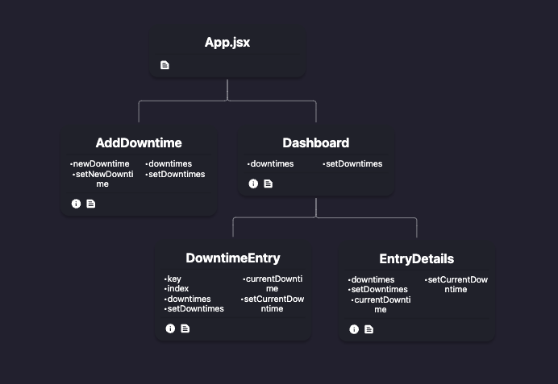

# Setup Instructions

### Running the Application

After cloning the repository, run the following commands in the project root directory (where `package.json` is located):

Install dependencies: `npm install`

Run the application: `npm run start`

The application will be available at `http://localhost:3000/`

### Brief Overview of the Application

Given the time I had to work on this project, I decided to use React to build the components and did basic css.

I chose to prop drill in this case because of the timeline and complexity of the requirements. In a more complex application, I would have used the Context API or Redux for state management.

Showen below is a component tree of the application with some of the props that are passed down:

If the data for sites, telescopes, and downtimes were coming from an API, I would have used the useEffect hook to fetch the data and store it in state. I would have also used the useEffect hook to update the data in the API when a downtime is added, edited, or deleted. To optimize the application, I would have used the useMemo hook to prevent unnecessary re-renders and a different data structure to store the downtimes, like a Map.

## Technical Challenges

Some technical challenges I faced were:

- Finding a library to use for the table sorting and filtering. I overcame this by building table components within the JSX, but I would have prefered to use a library for speeding up development.
- Effective styling: I would have spent more time deciding on the look and feel of the UI, but I wanted to focus on the core functionality of the application.

## Future Improvements

I had testing setup, but would have liked to implemented some unit tests at minimum with Jest. I would definitely like to add more styling to the application and make it more user friendly. I would also like to add the timeline and update table components to be sortable and filterable.

#### Thanks for your consideration! - Nathan Ngo
